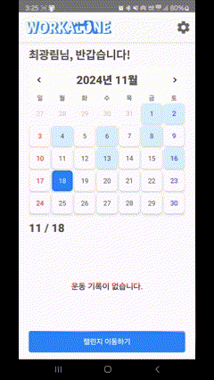
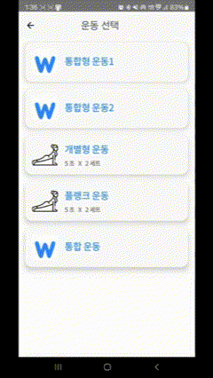
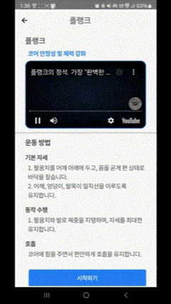
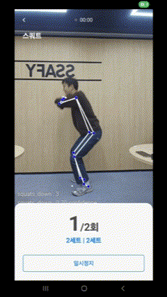
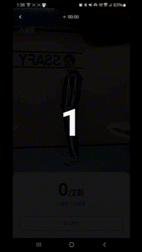
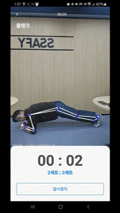

# WORKALONE

# 📖 프로젝트 소개

### **💪홈트레이닝 동반자 WorkAlone**

홈트레이닝은 접근성이 뛰어나지만 지속성이 떨어지는 단점이 있습니다.
 
사용자가 운동을 꾸준히 할 수 있도록 강제성을 부여하며,
  효율적으로 운동 습관을 관리할 수 있도록 돕습니다. 

# 📖개발 환경

### 🔧 BackEnd

  
    
  

  

  Openjdk:17-JDK-alpine 
  Intelij:2024.01 
Spring Boot:3.3.2
    

---

### 🎨 Android

  

Android Studio:2024.01 
Android API:35 

---

### 🗄️ DataBase

  
  

  MySQL:8.0
  
  

---

### 🛠 Infra

  
  
    

  AWS EC2 Ubuntu 20.04.6 LTS
  

# 🛠️ 사용 도구

### 📝 이슈 관리

**프로젝트 이슈와 일정 관리를 위한 도구입니다.**

---

### 💾 형상 관리

**버전 관리 및 코드 형상 관리를 위한 GitLab을 사용합니다.**

---

### 💬 커뮤니케이션

  

**팀 내 문서 공유 및 실시간 커뮤니케이션을 위한 도구입니다.**

---

### 🎨 디자인

**UI/UX 디자인 협업을 위한 도구입니다.**

---

### ⚙️ CI/CD

**자동 빌드 및 배포 관리를 위한 Jenkins를 사용합니다.**

# 🏗️시스템 아키텍처

# 📄 명세서

프로젝트의 주요 명세서와 문서들을 확인할 수 있습니다.

<!--
### 📋 요구 사항 명세서

[🔗 요구 사항 명세서 보기](https://docs.google.com/spreadsheets/d/1vXI50DEy7T1m6U_-cBndaAqHpatty2hZtrPbOcFo_eY/edit?gid=0#gid=0)
프로젝트에서 요구하는 기능 및 요구 사항들을 정리한 문서입니다.

---

### 🖼️ 와이어 프레임

[🔗 와이어 프레임 보기](https://www.figma.com/design/GHScAyjAlD6kMdfoWoZRvL/Untitled?node-id=0-1&m=dev&t=Q4ZNNhtFrOs5a9L4-1)
서비스 화면의 UI 설계를 확인할 수 있는 와이어 프레임입니다.

---

### 🗂️ ERD Diagram

[🔗 ERD Diagram 보기](https://www.erdcloud.com/d/KEihe68iHdjzxxxBh)
데이터베이스의 구조를 시각적으로 표현한 ERD 다이어그램입니다.

---

### 📑 API 명세서

[🔗 API 명세서 보기](https://docs.google.com/spreadsheets/d/1vXI50DEy7T1m6U_-cBndaAqHpatty2hZtrPbOcFo_eY/edit?gid=1657403701#gid=1657403701)
프로젝트에서 사용되는 API의 기능과 상세 내용을 기록한 명세서입니다.

 -->

# 🌟 주요 기능

### ⭐️ 운동 기록 관리

📋진행한 **운동 기록**을 확인하고, 운동의 **상세 설명** 확인이 가능합니다.

<table align="center">
  <tr>
    <td align="center"><strong>메인화면</strong></td>
    <td align="center"><strong>운동 설명</strong></td>
  </tr>
  <tr>
    <td></td>
    <td></td>
  </tr>
</table>

---

### ⭐️ 운동 준비

⏱️운동 간 적절한 **쉬는 시간**을 제공하여 효율적인 운동을 도와줍니다.
 
➡️다음 운동으로 자연스럽게 이어질 수 있도록 **안내**합니다.

<table align="center">
  <tr>
    <td align="center"><strong>운동 시작</strong></td>
    <td align="center"><strong>다음 운동</strong></td>
  </tr>
  <tr>
    <td></td>
    <td></td>
  </tr>
</table>

---

### ⭐️ 운동 감지

💪온디바이스 AI로 운동 탐지하고, 결과를 실시간으로 알려줍니다.

<table align="center">
  <tr>
    <td align="center"><strong>운동 진행</strong></td>
    <td align="center"><strong>운동 완료</strong></td>
  </tr>
  <tr>
    <td></td>
    <td></td>
  </tr>
</table>

# 👥 팀원

<table>
  <tr>
    <th align="center">김현태</th>
    <th align="center">박정민</th>
    <th align="center">윤성현</th>
    <th align="center">이은우</th>
    <th align="center">이찬진</th>
    <th align="center">최광림</th>
  </tr>
  <tr>
    <td align="center"></td>
    <td align="center"></td>
    <td align="center"></td>
    <td align="center"></td>
    <td align="center"></td>
    <td align="center"></td>
  </tr>
  <tr>
    <td align="center">
      
    </td>
    <td align="center">
      
    </td>
    <td align="center">
      
    </td>
    <td align="center">
      
    </td>
    <td align="center">
      
    </td>
    <td align="center">
      
    </td>
  </tr>
</table>
